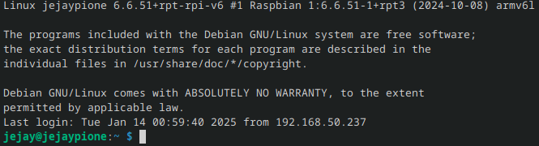
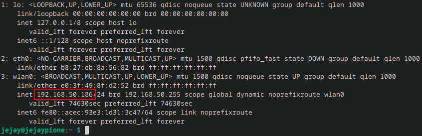
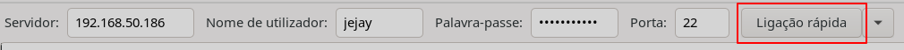
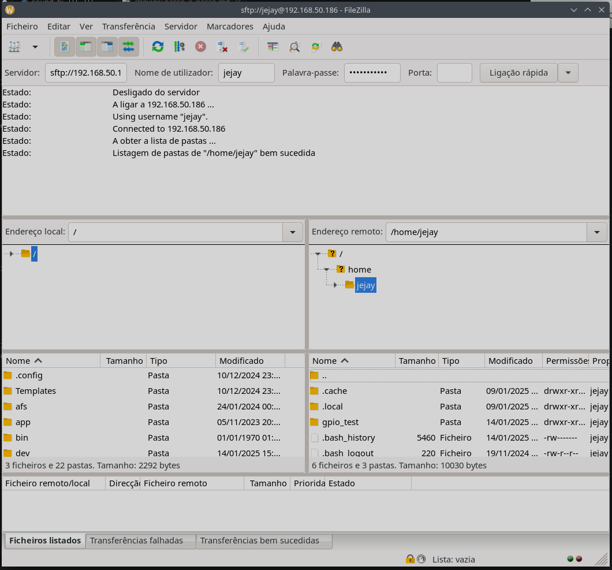
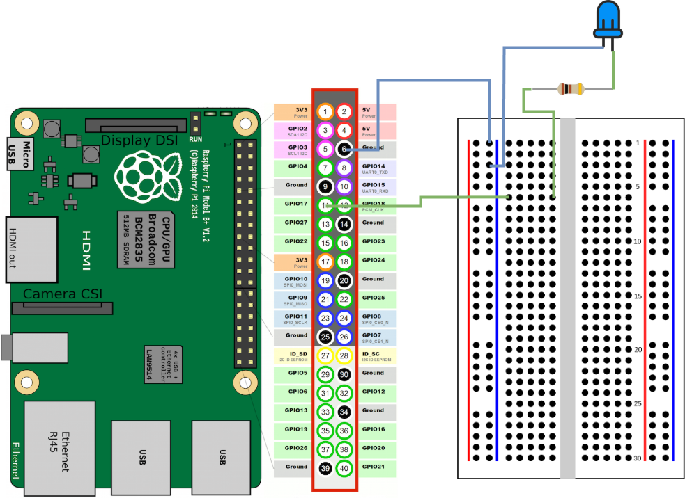

# passo a passo

## O que vamos usar

- Raspberry PI
- breadboard (para testar o nosso circuito)
- vários cabos
- vários botões
- um switch
- um multímetro (opcional)
- legos :D

## Passos

  - Desktop - criar um script em python que escrever alguma coisa no ecrã
  - Desktop - formatar o cartão e escolher o sistema operativo
  - RPI - meter o cartão, ligar os cabos necessários e ligar o RPI
  - Desktop - fazer acesso remoto (fazer alguns testes)
  - RPI - adicionar a breadboard, adicionar 1 led
  - Desktop - criar um script para o led e executa no RPI
- RPI - adicionar um botão à breadboard
- Desktop - actualizar o script para escrever alguma coisa no ecrã quando o botão é carregado
- RPI - adicionar a coluna ao RPI
- Desktop - actualizar o script para dar som quando o botão é carregado
- RPI - adicionar mais botões à breadboard
- Desktop - adicionar mais botões ao script
- RPI - adicionar o switch para as várias layers
- Desktop - adicionar o suporte para varias layers de audio

# Passo 1

Para começar vamos escrever um pequeno script e executa-lo para ver o que acontece.

Primeiro cria um ficheiro chamado `helloworld.py` e adiciona o seguinte código:

```python
print("hello world")
```

Agora abre um terminal e executa o script escrevendo: 

```bash
python helloworld.py
```

**Nota:** O que aconteceu?

# Passo 2

Para formatar o cartão e instalar o sistema desejado, vamos utilizar a aplicação [Raspberry Pi Imager](https://www.raspberrypi.com/software/).

Para isso, abre a aplicação `Raspberry PI Imager`.

- Escolhe o device que estás a utilizar.
- O OS para este projecto será o `Raspberry Pi OS (other ) -> Raspberry Pi OS Lite (32-bit)`, mas podes usar também o `Raspberry Pi OS` que se encontra logo no inicio
- O storage é o cartão de memória

E agora é so carregar em NEXT

# Passo 3

Agora é hora de ligar o Raspberry Pi.

Liga um cabo de rede ou caso tenhas configurado o WiFi no passo anterior, o Raspberry Pi vai-se ligar automaticamente à rede (se for um Raspberry Pi antigo poderás precisar de uma pen WiFi).

Mete o cartão de memória.

E por fim, liga o cabo USB para dar carga ao Raspberry Pi.

# Passo 4

Agora abre um terminal no desktop e  para te ligares remotamente ao Raspberry Pi utilizando SSH

No terminal escreve:

```bash
ssh hostname.local -l username
```

Onde hostname e username são os dados que definiste no passo 2

Escreve a password e já está:



Aproveita para saber o teu IP que vais precisar já a seguir, para isso escreve:

```bash
ip addr
```



Neste caso o IP é o **192.168.50.186**

Abre também uma ligação SFTP para ser mais fácil transferir ficheiros, podes utilizar uma aplicação chamada [FileZilla](https://filezilla-project.org/).

Utiliza o teu IP **192.168.50.186** (no meu caso), nome de utilizador **username**, a tua **password**, e a porta é a 22





Agora já consegues a ver os ficheiros dentro do Raspberry Pi.

# Passo 5

Desliga o Raspberry Pi por agora.

Agora liga um cabo entre o pin 6 e a linha com um "-" na breadboard.

Depois liga um cabo entre o GPIO 17 e uma das linhas do meio.

Vais precisar de uma resistência e de um Led.

Liga uma resistência entre a linha do GPIO 17 e a perna mais longa do Led, depois a liga a perna mais curta do Led à linha "-".



# Passo 6

Agora é preciso controlar o Led, e para isso vais por o Led a piscar.

No desktop cria um ficheiro chamado `led.py` com o seguinte código:

```python
from gpiozero import LED
from time import sleep

led = LED(17)

while True:
    led.on()
    sleep(1)
    led.off()
    sleep(1)
```

Isto vai activar o Led no pin GPIO 17 e depois ligar e desligar enquanto não parares o script.

Agora liga novamente o Raspberry Pi e acede pelo FileZilla.

Copia o ficheiro para o Raspberry Pi.

E por fim liga-te por SSH e escreve `python led.py` e vê a magia a acontecer.

**Nota:** aproveita para brincar com os tempos ou até mesmo alterar o script. Se tiveres um multímetro, podes usar para ver a Voltagem a mudar quando o Led é ligado ou desligado.

# Passo 7

Desliga o Raspberry Pi por agora.

Agora vais adicionar o primeiro botão.

O botão é nada mais que uma peça electronica que só passa corrente quanto carregamos nele, e vais usar isso para enviar dados para o Raspberry Pi.

A ligação é muito simples, encaixa o botão no centro da breadboard.

Liga um cabo entre o GPIO 27 e a linha da breadboard que está ligada a uma das pernas do botão.

E agora mais um fio entre e "-" e a outra perna do botão que está do mesmo lado onde ligaste o fio anterior.

Não te esqueças também de ligar uma coluna ao Jack to Raspberry Pi.


Hora do código.

# Passo 7

Cria novamente um ficheiro **passo7.py** com o seguinte código:

```python
from gpiozero import LED
from time import sleep
from sound_button import SoundButton

led = LED(17)

SoundButton(
  27,
  [
    "./audio_button1_1.wav"
  ]
)

while (True):
  led.on()
  sleep(1)
  led.off()
  sleep(1)

```

Agora liga novamente o Raspberry Pi e acede pelo FileZilla.

Copia os ficheiros **passo7.py, sound_button.py, sound_file.py e fileParser.py**, para o Raspberry Pi.

Liga-te por SSH e instala as dependências `pip install numpy simpleaudio`.

E por fim `python passo7.py`.