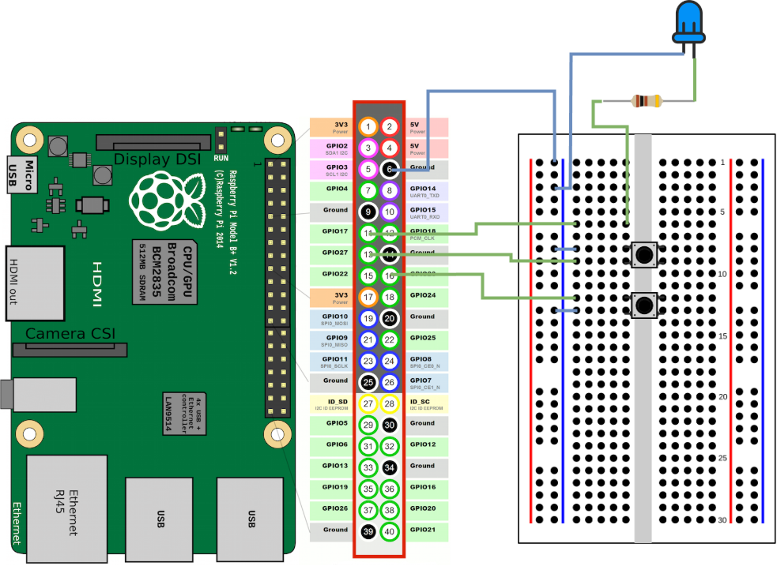

# Step by Step

## What We Will Use

- Raspberry PI  
- Breadboard (for testing our circuit)  
- Various cables  
- Various buttons  
- A switch  
- A multimeter (optional)  
- Legos :D  

## Steps

1. **Desktop** - Create a Python script that writes something on the screen  
2. **Desktop** - Format the SD card and choose the operating system  
3. **RPI** - Insert the SD card, connect the necessary cables, and power on the RPI  
4. **Desktop** - Establish remote access (run some tests)  
5. **RPI** - Add the breadboard and a LED  
6. **Desktop** - Create a script for the LED and run it on the RPI  
7. **RPI** - Add a button to the breadboard  
8. **Desktop** - Create a script to play a sound when the button is pressed  
9. **RPI** - Add more buttons to the breadboard  
10. **Desktop** - Add more buttons to the script  
11. **RPI** - Add the switch for different layers  
12. **Desktop** - Add support for multiple layers of audio  

---

# Step 1

To start, let's write a small script and run it to see what happens.  

First, create a file named `helloworld.py` and add the following code:

```python
print("hello world")
```

Now open a terminal and run the script by typing:

```bash
python helloworld.py
```

**Note:** What happened?

---

# Step 2

To format the SD card and install the desired system, we will use the [Raspberry Pi Imager](https://www.raspberrypi.com/software/).  

Open the `Raspberry Pi Imager` application.  

- Select the device you are using.  
- The OS for this project will be `Raspberry Pi OS (other) -> Raspberry Pi OS Lite (32-bit)`, but you can also use the default `Raspberry Pi OS`.  
- The storage option is your SD card.  

Now just click NEXT.

---

# Step 3

Now it's time to power on the Raspberry Pi.  

Connect a network cable, or if you've set up WiFi in the previous step, the Raspberry Pi will connect automatically (for older models, you might need a WiFi dongle).  

Insert the SD card.  

Finally, connect the USB cable to power the Raspberry Pi.

---

# Step 4

Now open a terminal on your desktop to remotely access the Raspberry Pi using SSH.  

In the terminal, type:

```bash
ssh hostname.local -l username
```

Where `hostname` and `username` are the details you set in step 2.  

Enter your password and you're in:


Find your IP address by typing:

```bash
ip addr
```


In this example, the IP is **192.168.50.186**.

Also, open an SFTP connection to transfer files easily. You can use [FileZilla](https://filezilla-project.org/).

Use your IP **192.168.50.186** (in my case), username **username**, your **password**, and port **22**.


Now you can see the files inside the Raspberry Pi.

---

# Step 5

Turn off the Raspberry Pi for now.

Now connect a cable between pin **6** and the line with a "-" on the breadboard.  

Then, connect a cable between **GPIO 17** and one of the middle lines.  

You'll need a resistor and a LED.  

Connect a resistor between the **GPIO 17** line and the longer leg of the LED, then connect the shorter leg of the LED to the "-" line.


---

# Step 6

Now, let's control the LED by making it blink.  

On your desktop, create a file named `led.py` with the following code:

```python
from gpiozero import LED
from time import sleep

led = LED(17)

while True:
    led.on()
    sleep(1)
    led.off()
    sleep(1)
```

This will activate the LED on **GPIO 17**, turning it on and off continuously.

Now turn the Raspberry Pi back on and access it via FileZilla.  

Copy the file to the Raspberry Pi.  

Then, connect via SSH and run `python led.py` to see the magic happen.

**Note:** Try modifying the timing or even changing the script. If you have a multimeter, you can use it to see the voltage change when the LED turns on or off.

---

# Step 7

Turn off the Raspberry Pi for now.

Now, let's add the first button.

A button is simply an electronic component that allows current to pass only when pressed. You'll use this to send data to the Raspberry Pi.

The connection is very simple: place the button in the center of the breadboard.

Connect a cable between **GPIO 27** and the breadboard line connected to one leg of the button.  

Then, connect another cable between "-" and the other leg of the button, on the same side as the first wire.  

Don't forget to connect a speaker to the Raspberry Pi's audio jack.


Now, let's add the code.

---

# Step 8

Create a file **step7.py** with the following code:

```python
from gpiozero import LED
from time import sleep
from sound_button import SoundButton

led = LED(17)

SoundButton(
  27,
  [
    "./audio_button1_1.wav"
  ]
)

while True:
    led.on()
    sleep(1)
    led.off()
    sleep(1)
```

Now turn the Raspberry Pi back on and access it via FileZilla.  

Copy the files **step7.py, sound_button.py, sound_file.py, and fileParser.py** to the Raspberry Pi.  

Connect via SSH and install the dependencies with:

```bash
pip install numpy simpleaudio
```

Finally, run:

```bash
python s  
```

---

# Step 9

Always remember: **if you're going to modify the breadboard, turn off the Raspberry Pi first**.

Use what you've learned so far and try adding more buttons to the breadboard.

---

# Step 10

Now that you have more buttons, update the script to include them and assign a different sound to each.

---

# Step 11

Everything working? Great!

Now let's add even more options to our buttons.

We'll make each button support up to four sounds and allow switching between them.

For this, you'll need one more button, which will act as a **layer switch** instead of playing a sound.

Each time you press this button, it will activate a new set of sounds for the buttons.

Place the button in the center of the breadboard.

Connect a cable between **GPIO 16** and the breadboard line connected to one leg of the button.

Then, connect another cable between "-" and the other leg of the button, on the same side as the first wire.



---

# Step 12

Now, update your script.

Add the following code:

```python
from layer_switch import LayerSwitch

layerSwitch = LayerSwitch(16)
```

Also, update your buttons by adding another parameter:

```python
SoundButton(
  27,
  [
    "./audio_button1_1.wav"
  ],
  layerSwitch
)
```

Notice that now we are passing `layerSwitch` as a parameter to the button. This allows the button to know which sound to play when pressed.

**Note:** What is happening? How can you improve it? What ideas do you have to expand on this even further?